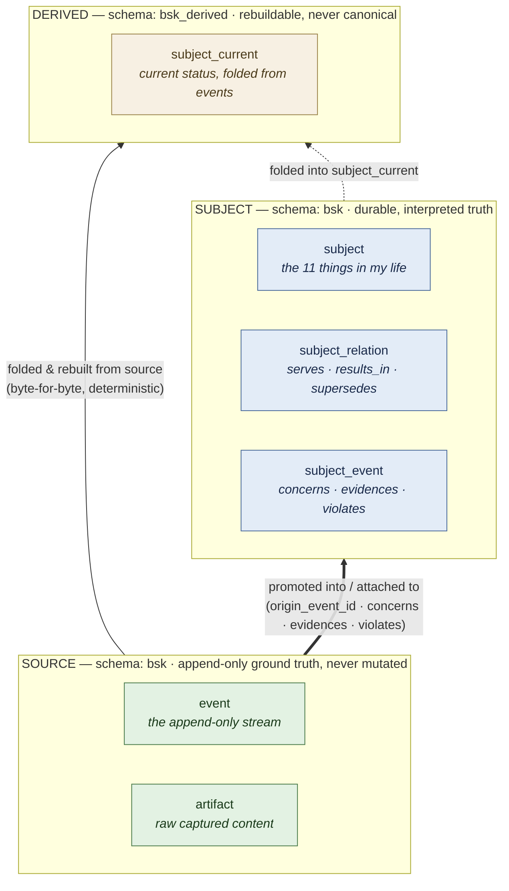

# The LifeOS Ontology — Design Document

**Status:** Stage 1 (Life Kernel). Describes the ontology as implemented in
`db/migrations/0001`–`0007` and `src/LifeOs.Domain`.
**Audience:** anyone deciding whether the Life ontology is the right foundation for
BlueSkies Life Intelligence, or extending it.

---

## 1. What this document is

The [README](../README.md) states the *destination*: a continuously-learning personal
intelligence system — BlueSkies Life Intelligence — that builds a trustworthy model of a
life, protects attention, coaches, delegates, and accumulates a governed history across
every interface.

This document describes the *foundation* underneath that destination: the **ontology** —
the fixed set of things the system believes a life is made of, the relationships it allows
between them, and the rules that keep the record honest. Stage 1 (this repo, the "Life
Kernel") builds nothing but that foundation and the tools to exercise it: a PostgreSQL
schema, the `bsk` CLI as the sole write path, and deterministic diagnostics. No UI, no
agent, no integrations.

The whole repo is an **explicit hypothesis test**: *does this ontology survive contact
with real daily use?* Everything below is written so that question can be answered — and
so the ontology can be discarded with `rm -rf` if the answer is no.

---

## 2. What "ontology" means here, and why it comes first

An ontology is a commitment about *what exists*. For a personal intelligence system, that
commitment is load-bearing: every later capability — surfacing what matters, flagging
neglected commitments, delegating work, coaching against drift — is a query or a rule over
this vocabulary. If the vocabulary is wrong, no amount of model quality upstream fixes it;
the system will be fluent about the wrong things.

So Stage 1 fixes the ontology *before* building anything that consumes it, and makes it
cheap to be wrong:

- The ontology is small and named explicitly (§4), not implied by scattered code.
- It is enforced at the **database** level (CHECK constraints, triggers, unique indexes),
  not just in application code, so a future non-CLI writer cannot quietly violate it.
- It is **standalone and disposable** — the cost of discarding a bad ontology is deleting
  a repo, not untangling it from a running product.

This is the same bet the BlueSkies **trading system** made and won: an event-sourced,
provenance-tagged, continuously-learning core, with a rigid record and rebuildable
projections on top. The Life Kernel generalizes that architecture from *a portfolio* to
*a life*.

---

## 3. The three layers

The ontology is organized as three layers with a strict, one-directional trust
relationship. This structure is the ontology's backbone: it is *what* lets the system be
both immutable-at-the-core and freely re-interpretable on top.



*Trust flows upward only. **Source** (bottom) is never rewritten. **Subjects** are promoted
from and attach to Source events, but never mutate them. **Derived** (top) is recomputed
from both layers and owns nothing — discard it and `bsk rebuild` reproduces it byte-for-byte.
The individual id references that wire rows together (`origin_event_id`, `artifact_id`, the
edge foreign keys) are summarized on the arrows rather than drawn per-row.*

**Source** is the append-only truth: raw captured `artifact` content and the `event`
stream that references it. It is never mutated — UPDATE and DELETE are denied by trigger at
the database level.

**Subject** is the interpreted layer: the durable *things* a life is organized around
(Goals, Projects, Commitments, People…) and the typed edges between them. Subjects are
asserted by a human or agent; they are source-of-truth too, but *interpretive* truth
rather than raw truth.

**Derived** is disposable re-interpretation: projections computed from source, regenerated
on demand. Stage 1 ships exactly one — `subject_current`, the current status of each
subject. Nothing in this layer is canonical; `bsk rebuild` truncates and repopulates it
from source, and its output is deterministic and byte-comparable across runs.

Why this shape matters for the destination: the README promises a model that *learns* —
that revises its understanding "from reflection, and the outcomes of earlier decisions."
A learning system must be free to re-interpret without ever corrupting the record it is
interpreting. The immutable Source guarantees the past is never rewritten; the disposable
Derived layer guarantees any interpretation can be thrown away and recomputed. New
inference methods, better coaching heuristics, a smarter "what matters now" — all of these
are new *derived* projections over an unchanged source, not migrations of precious data.

---

## 4. The vocabulary

The ontology's vocabulary is fixed and enumerated in two mirrored places: the database
CHECK constraints (authoritative) and `src/LifeOs.Domain/Vocabulary.cs` (the code mirror).
Adding a term is a deliberate act in both.

### 4.1 Subject types — the 11 things a life is made of

`bsk.subject` is a **single table** with a `type` column and a typed `attributes` jsonb
column. All 11 types share one table; per-type tables are intentionally avoided until a
type stabilizes and earns real constraints. This means exercising or adding a type costs
**zero DDL** — critical while the hypothesis is still under test.

| Type | What it represents |
| --- | --- |
| **Value** | An enduring principle — who I've chosen to be. Stated as a short **handle** (the title, which drives the slug) plus a full first-person **identity statement** (`attributes.statement`, required). The top of the alignment graph. |
| **Goal** | A desired outcome that serves a Value. |
| **Problem** | A durable open question I return to (the reuse-by-title anchor, §6). |
| **Project** | A body of work that results in outcomes and serves Goals/Commitments. |
| **Task** | A unit of work. Deliberately a **leaf** (§5) — nothing serves a Task. |
| **Commitment** | Something I've committed to, that events can *evidence* or *violate*. |
| **Decision** | A choice made, with its reasoning preserved. |
| **Idea** | A candidate, often promoted from an idea session. |
| **Person** | A person the record concerns. |
| **Constraint** | A limit on capacity or interaction (scope lives in `attributes`). |
| **Season** | A bounded period that contextualizes everything else. |

Each subject has a stable, human-referenceable **URN** — `urn:bsk:<type>:<slug>-<shortid>`
(e.g. `urn:bsk:problem:how-do-i-sleep-a1b2c3`). The slug keeps it readable; the short id
makes it unique by construction. This is the identity by which people, scripts, and future
agents name a subject without quoting a raw UUID.

### 4.2 Event kinds — the 9 shapes of what happens

`bsk.event.kind` ∈ { `journal`, `note`, `voice`, `idea_session`, `observation`,
`activity`, `measurement`, `interaction`, `state_change` }.

Events are the raw stream of *what happened*: things I wrote or said, things observed about
me, things measured, interactions, and — one special kind — `state_change`, the only way a
subject's status ever moves (§5, invariant 8).

### 4.3 Relations — the edges

The ontology distinguishes two structurally different kinds of edge, and enforces the
difference in two separate tables:

**Subject → subject** (`bsk.subject_relation`): `serves`, `results_in`, `supersedes`.
These wire the *alignment graph* — a Task `serves` a Commitment, a Project `results_in` a
Goal, a Decision `supersedes` an earlier one.

**Event → subject** (`bsk.subject_event`): `concerns`, `evidences`, `violates`. An event
`concerns` any subject (a journal entry concerns a Project and a Person); an event
`evidences` or `violates` a Commitment. These are the edges by which *the raw record
attaches to the interpreted world* — the substrate for "am I actually keeping this
commitment?" queries.

> **A design correction worth noting** (migration `0007`): these three were once listed as
> subject→subject relations, but they are fundamentally *event*→subject. The edge table
> could *name* them but structurally could not *point them at an event*. Splitting the two
> tables is an example of the ontology being taken seriously enough to fix rather than fudge.

`promoted_from` is deliberately **not** a relation. The fact "this subject came from that
event" is a first-class column — `subject.origin_event_id` — not an edge, because two
representations of the same fact is one too many (§5).

### 4.4 Provenance — every fact knows where it came from

Every event and every edge carries `provenance` ∈ { `declared`, `observed`, `derived` }:

- **declared** — I asserted it directly.
- **observed** — read off behavior or an external source.
- **derived** — an agent/computation inferred it (and must cite its sources).

Provenance is not decoration. The README's central promise is a **trustworthy** model and
**explainable** interventions. Provenance is how trust is made mechanical: any claim the
system surfaces can be traced to whether *I* said it, something *watched* me do it, or
*inference* produced it — and if inference, to exactly which source events
(`event.derived_from`, enforced non-empty for derived events). A coach that can't say why
it believes something has no business intervening; provenance is what lets it always say.

---

## 5. The invariants that keep the record honest

The ontology is not just a vocabulary — it is a set of rules that hold *regardless of who
is writing*, enforced as close to the data as possible. These are the epic invariants; the
migrations cite them by number.

1. **Append-only source** (inv. 3, 5). `event` and `artifact` reject UPDATE and DELETE via
   a database trigger. The past is physically un-rewritable.
2. **Every fact carries provenance** (inv. 4), and derived facts must cite their sources
   (`event_derived_has_sources` CHECK).
3. **Promotion never mutates the capture** (inv. 5). Turning a captured thought into a
   tracked subject records `origin_event_id` on the *new* subject; the original event stays
   byte-identical. Your raw words are never overwritten by the tidy object they became.
4. **Bitemporality** (inv. 6). Every event separates `occurred_at` (when it happened) from
   `recorded_at` (when we learned it). The system can reason about a life as it *was known
   at a time*, not just as it is now.
5. **Idempotency** (inv. 7). `(source_id, external_id)` is unique — the same external fact
   ingested twice collapses to one event. This is what lets "configurable data sources"
   (README) be wired in later without polluting the history with duplicates.
6. **Status changes only by event** (inv. 8). A subject's status is never edited in place;
   it moves only by appending a `state_change` event. `subject_current` *folds* those
   events — newest-occurrence-wins, deterministically tie-broken. The current state of
   anything is always reconstructible, and always explainable by the event that set it.
7. **`bsk` is the only write path** (inv. 9). Every other consumer reads Postgres directly
   through the `bsk_reader` role (SELECT-only, no write grants). One writer, many readers.
8. **Task is a leaf** (`RelationRules`). Nothing may `serves` a Task. This keeps the
   alignment graph from degenerating into chains of tasks serving tasks, where *"does this
   work serve anything I care about?"* stops being answerable — the exact question the
   system exists to keep answerable.
9. **Reuse-by-title where it matters** (migration `0006`). A `Problem` is unique by title,
   backed by a real unique index — so "the durable question I keep returning to" is
   genuinely *one* object, not a new one each time I raise it.

Enforcing these in the database rather than only in `bsk` is deliberate: the README's
vision is *many* doors into *one* authoritative store (mobile, voice, agents, future BCI).
The invariants have to hold no matter which door a write comes through — so they live below
all the doors.

---

## 6. The lifecycle — how the ontology is used

The pieces above come together as a flow from raw capture to explainable insight. The `bsk`
verbs (in `src/LifeOs.Cli`) map onto it:

```
  capture / journal / ideas / log      →  append raw events + artifacts        (SOURCE)
  promote                              →  event  ──origin_event_id──▶  subject  (SOURCE→SUBJECT)
  new / decide                         →  create subjects directly              (SUBJECT)
  link                                 →  subject ──serves/results_in──▶ subject (SUBJECT edges)
  log ... --concerns/--evidences/...   →  event  ──concerns/evidences──▶ subject (event→subject)
  status                               →  append state_change event             (SOURCE)
  rebuild                              →  fold events → subject_current          (DERIVED)
  check                                →  run diagnostics, cite evidence         (READ)
```

1. **Capture cheaply.** A thought, note, voice memo, observation, or measurement lands as
   an immutable event (plus its raw artifact). No structure required at capture time —
   friction here is the enemy of a complete record.
2. **Promote when it earns durability.** A capture that turns out to be a real Problem,
   Idea, or Project is *promoted* into a subject, anchored back to its origin event without
   altering it.
3. **Wire the alignment graph.** `link` connects subjects — Tasks serve Commitments,
   Projects result in Goals, Goals serve Values — so any piece of work can be traced up to
   a Value, or a Value traced down to the work serving it.
4. **Attach the record to the graph.** Events `concern`, `evidence`, or `violate` subjects,
   so the raw stream is queryable against the durable things — "every event about this
   Project", "events that evidenced this Commitment this week".
5. **Move state by appending, never editing.** `status` writes a `state_change` event;
   `rebuild` folds the stream into `subject_current`.
6. **Diagnose deterministically.** `bsk check` runs plain-SQL diagnostics — no model
   involved — and every finding names the subject, the rule that fired, and the **evidence
   rows** (event/edge ids) that triggered it. *Explaining itself is built in: no finding is
   unexplained.*

---

## 7. Why this ontology serves the README's goals

Each high-level goal in the README reduces to a query, rule, or guarantee over the
ontology. That reduction is the whole point of fixing the ontology first.

| README goal | What in the ontology delivers it |
| --- | --- |
| **A trustworthy, evolving model of my life** | Immutable Source + disposable Derived: the model can be re-derived and improved endlessly without ever corrupting or losing the record it is built from. Provenance makes every belief traceable. |
| **Protects my attention** | The alignment graph (`serves` / `results_in`) plus `state_change` history make "what matters now", "neglected commitments", and "conflicts" *computable*. `bsk check` is the Stage-1 seed of exactly this: rules that fire against your own data. |
| **Adaptive coach whose interventions stay explainable** | Every diagnostic finding cites its evidence; every fact carries provenance. An intervention can always answer "why are you telling me this?" with source rows — the precondition for coaching that respects autonomy. |
| **Launchpad for delegating work** | Subjects + provenance + the single write path give an agent typed context, a record of what it did (as provenance-tagged events), and a store it can read but only write through `bsk` — permissions and progress tracking fall out of the structure. |
| **Works across every interface** | `bsk` is the *only* writer; everyone else reads through `bsk_reader`. Mobile, voice, BI, future BCI are all just more readers and more callers of the one write path — different doors, one authoritative store, invariants enforced below all of them. |
| **Accumulates a governed history** | Append-only, bitemporal, deduplicated, provenance-tagged Source *is* the governed history. As interfaces advance, more ambient assistance is more projections over the same growing record — no re-architecture. |

The long-term destination — a trusted cognitive companion that guides with minimal effort
while leaving me in control — depends on exactly the properties this ontology makes
structural: **honesty** (immutable, provenanced record), **explainability** (evidence-bearing
derivations), and **control** (one auditable write path, disposable interpretations). The
ontology is the smallest thing that makes those properties non-negotiable rather than
best-effort.

---

## 8. What Stage 1 deliberately leaves out

The hypothesis under test is the *ontology*, so everything not needed to test it is
excluded on purpose: no UI, no agent, no integrations, and only one derived projection.
Types live in a single jsonb-backed table and graduate to real per-type constraints only
once they've earned them (Problem's uniqueness index is the first such graduation). This is
not incompleteness — it is the disposability the README insists on: keep the surface small
enough that a wrong ontology is a deletion, not an extraction.

If the ontology survives daily use, later stages add the doors (interfaces), the mind
(agents/coaching), and the senses (integrations) *on top of* an unchanged core. If it
doesn't, we learn that cheaply — which is the point.

---

### Reference — where each piece lives

| Concept | Location |
| --- | --- |
| Schema namespace, layering | `db/migrations/0001__baseline.sql`, `0004__subject_current.sql` |
| Source tables + append-only triggers | `db/migrations/0002__source_tables.sql` |
| Subjects + subject→subject edges | `db/migrations/0003__subject_relation.sql` |
| Event→subject edges (design correction) | `db/migrations/0007__subject_event.sql` |
| Reader role, flattened views, indexes | `db/migrations/0005__reader_and_indexes.sql` |
| Problem uniqueness | `db/migrations/0006__problem_title_unique.sql` |
| Vocabulary (code mirror) | `src/LifeOs.Domain/Vocabulary.cs` |
| Graph shape rules | `src/LifeOs.Domain/RelationRules.cs` |
| URN scheme | `src/LifeOs.Domain/Urns.cs` |
| Promotion (no-mutate) | `src/LifeOs.Application/Subjects/PromotionService.cs` |
| Diagnostics contract | `db/diagnostics/README.md` |
